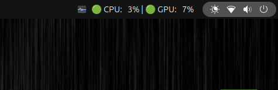

# DGX Spark CPU & GPU Monitor

A lightweight GNOME status bar widget for the NVIDIA DGX Spark. It displays real-time CPU and GPU utilization with status indicators (🟢 <=50%, 🟡 >50%, 🔴 >80%) and provides a dropdown menu showing the top 5 CPU and GPU consuming processes.



## Prerequisites

Install the required system dependencies:

```bash
sudo apt update
sudo apt install -y python3-gi gir1.2-ayatanaappindicator3-0.1 python3-psutil
```

## Running Manually

Run the script using the system Python interpreter:

```bash
/usr/bin/python3 monitor.py
```

## Run at Boot (GNOME Autostart)

To have the widget start automatically when you log in to your GNOME desktop:

1. Create the autostart directory if it doesn't already exist:
   ```bash
   mkdir -p ~/.config/autostart
   ```

2. Create a new desktop entry file:
   ```bash
   code ~/.config/autostart/spark-monitor.desktop
   ```

3. Paste the following configuration. Ensure the `Exec` path matches the absolute path to your script:
   ```ini
   [Desktop Entry]
   Type=Application
   Exec=/usr/bin/python3 monitor.py
   Hidden=false
   NoDisplay=false
   X-GNOME-Autostart-enabled=true
   Name[en_US]=Spark Monitor
   Name=Spark Monitor
   Comment=Start CPU/GPU Monitor Widget
   ```

4. Save the file. The widget will now launch automatically on your next login.
